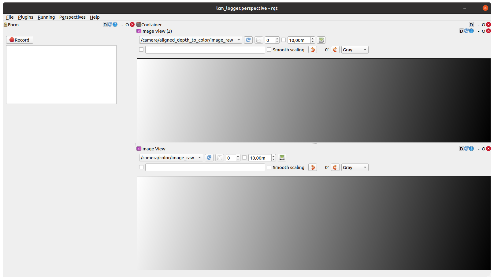

# rqt lcm-logger

rqt plugin for recording lcm log files.

### Requirements
You need to have lcm installed. Build instructions can be found [here](https://github.com/lcm-proj/lcm/blob/master/docs/content/build-instructions.md)

### LCM-Logger example
This plugin can be used for recording depth and color images via lcmlog files. A rqt perspective file as seen below is provided under `rqt_config/lcm_logger.perspective`
